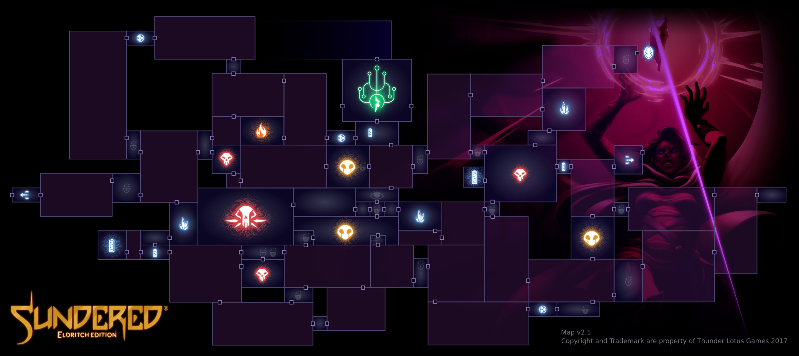
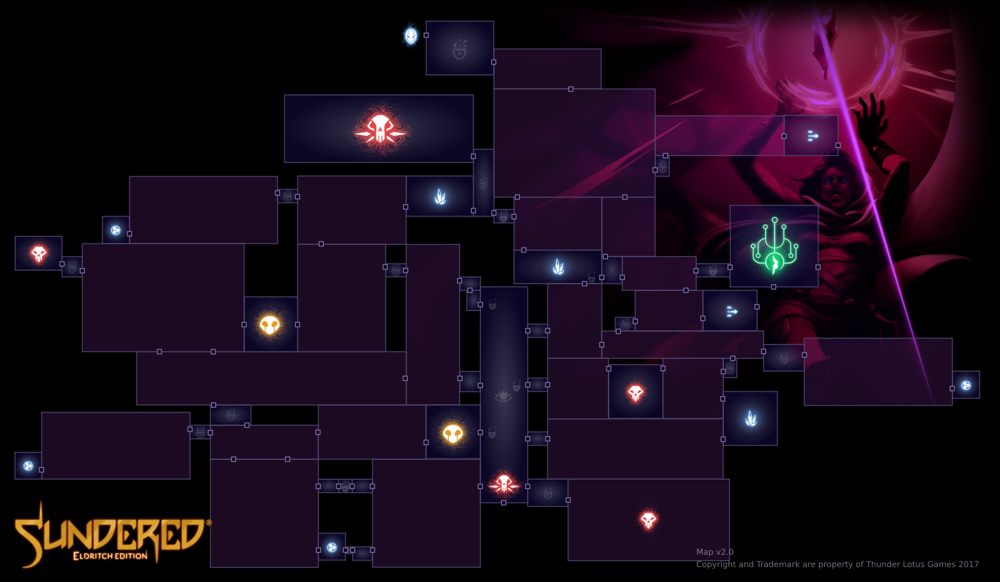
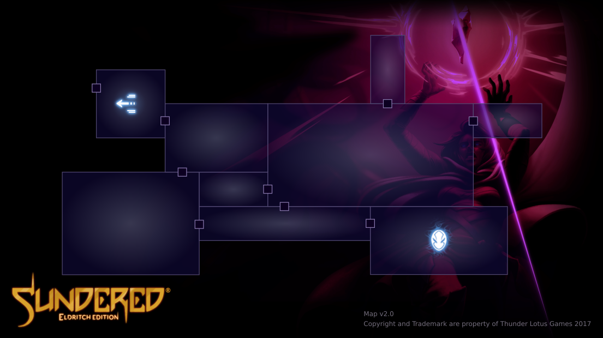
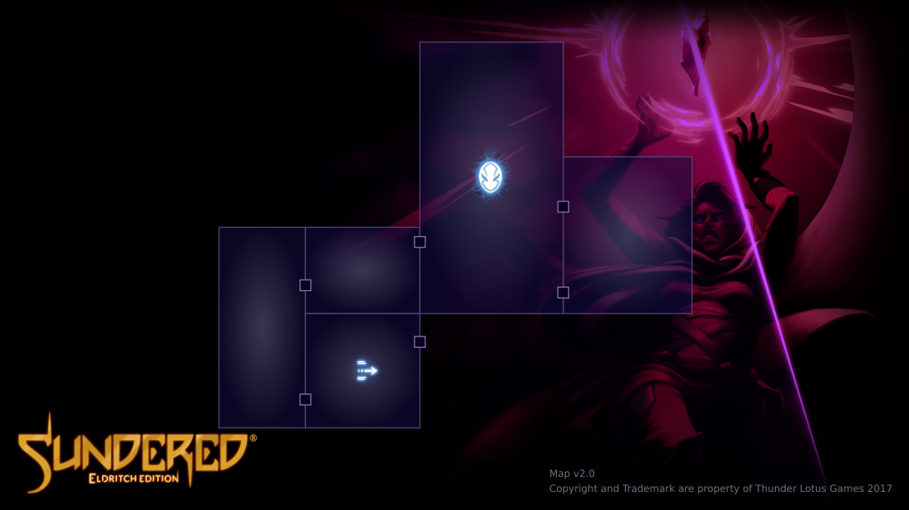
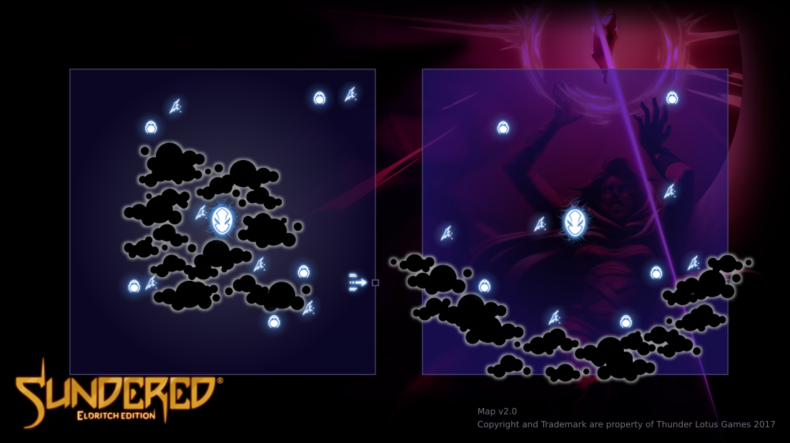

Because any up to date full maps weren't accessible anywhere, I created this small project to help the Sundered speedrun community

[Sundered Speedrun Discord](https://discordapp.com/invite/vHRDAkX)

[Speedrun.com](https://www.speedrun.com/sundered/)

### Region 1

### Region 2

### Region 3

#### Mask 1  
[Basic Cable Layout](pngs/SunderedMaps_BonusR1-Cables.png)

#### Mask 2

#### Mask 3

# Updates
##### 2021 / 02 / 05 - 
- **[FIX]** - Add a missing door for the Shield room

##### 2020 / 02 / 27 - V2 maps
- **[Esthetic]** - Cloud effect
- **[Esthetic]** - Remove door line blur
- **[Esthetic]** - Dark room appearance
- **[Fix]** - Add the first room before entering the sanctuary

##### 2020 / 02 / 18 - Cables and Fixes
- **[Esthetic]** - R3 v0.8 - Add Elevator Paths
- **[Fix]** - R2 v1.2 - Remove unnecessary lock
- **[Fix]** - R2 v1.1 - Fix extraneous icons (Crystal, locks) and missing doorway
- **[New]** - Add Cable Layout for Region 1 Mask Map

##### 2020 / 02 / 16 - Clouds
- **[Esthetic]** - Both R3 v0.7 - Add Basic clouds 

##### 2020 / 02 / 15 - Bonus
- **[New]** - Add all 3 bonus masks region maps

##### 2020 / 02 / 14 - R3
- **[New]** - Region 3

##### 2020 / 02 / 13 - R1 & R2
- **[New]** - Region 1 and 2

## Thanks to :

- [Thunder Lotus Games](https://thunderlotusgames.com/) for making this great game.

- The Sundered Speedrun Community. Espacially : **Alchemyzt**, **Dyindud**, **JeviLuckee**, **KyrieZee**, **Med**, **Titanic880**, **Vega Sera**, **Warthermair**

- Discord messages making me want to do something about it:
    > "Not having easy access to a full map without opening the game hurts me - KyrieZee, 2019/02/06"

    > "Does anyone have an images of a full maps without numbers / etc?  I'm trying to make an any% route I can easily follow since an hour worth of crap isnt fun starting out" - Alchemyzt, 2020/02/12.

Softwares : 
- [Gimp 2.10.10](https://www.gimp.org/) - The Free & Open Source Image Editor
- [Inkscape 0.92.4](https://inkscape.org/) - A powerful, free design tool (SVG editor)

***All used assets are property of Thunder Lotus***
